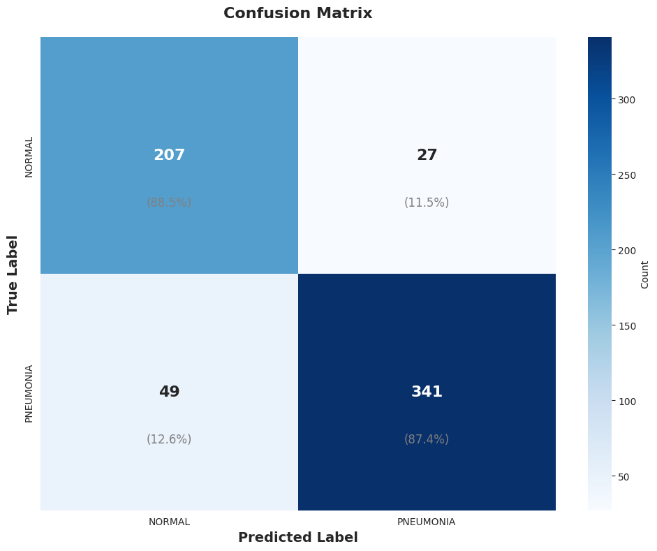
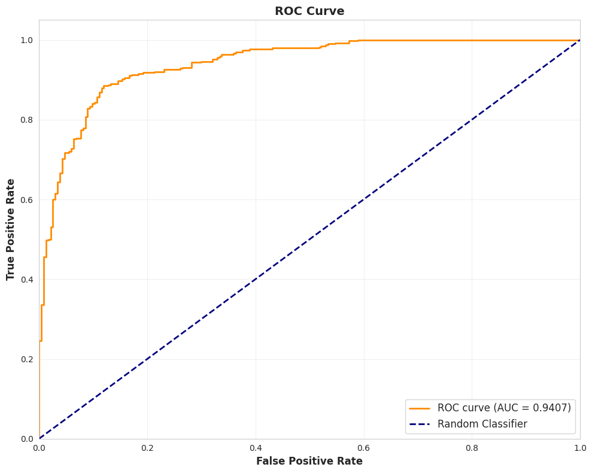

# Pediatric Pneumonia Detection System

## Overview
This project implements an end-to-end deep learning pipeline for automatic pneumonia detection from chest X-ray images.  
The system performs deep learning pipeline for detecting pneumonia in pediatric chest X-rays using a fine-tuned **ResNet-50** architecture.
The model uses a two-stage training process:

Stage 1: Trains the base layers of a pre-trained model.
Stage 2: Fine-tunes the entire model.

## Features
- Binary classification: NORMAL vs PNEUMONIA
- Pretrained CNN model (Keras / TensorFlow)
- Grad-CAM visual explanations
  


>*Grad-CAM visualizations highlighting the regions the model focuses on to make predictions.*

## Key Results

The model achieves high sensitivity (>94%), which is critical for medical screening to minimize missed cases (false negatives).

| Metric | Value | Interpretation |
| :--- | :--- | :--- |
| **Accuracy** | **87.82%** | Overall correctness of predictions. |
| **Sensitivity (Recall)** | **87.44%** | Ability to correctly identify Pneumonia cases. High sensitivity means few missed diagnoses. |
| **Specificity** | **88.46%%** | Ability to correctly identify Normal cases. |
| **Precision** | **92.66%** | Reliability of a "Pneumonia" prediction. |
| **F1-Score** | **89.97%** | Harmonic mean of precision and recall. |
| **AUC-ROC** | **0.9407** | Excellent discrimination capability vs random guessing. |

### Performance Visualizations

| Confusion Matrix | ROC Curve |
| :---: | :---: |
|  |  |
| *Breakdown of TP, TN, FP, FN* | *Trade-off between Sensitivity and False Positive Rate* |

---

## Project Structure

The project is designed to be modular and scalable:

```text
├── model_core/             # Core Logic Package
│   ├── data_pipeline.py    # Data loading, augmentation, and splitting
│   ├── model_builder.py    # ResNet-50 architecture definition
│   ├── trainer.py          # Training loop with callbacks (EarlyStopping, etc.)
│   ├── evaluator.py        # Metrics calculation and plotting
│   ├── gradcam.py          # Explainable AI (Heatmap generation)
│   └── utils.py            # Helper functions
│
├── notebooks/              # Jupyter Notebooks
│   └── Pneumonia Detection Pipeline.ipynb  # Complete end-to-end workflow
│
├── scripts/                # Execution Scripts
│   ├── train.py            # Script for training the model
│   └── evaluate.py         # Script for evaluating a trained model
│
├── assets/                 # Evaluation Artifacts (Plots & Metrics)
│
└── run/                    # Shell Scripts
    └── run.sh              # Helper script for running jobs (Slurm compatible)
```

## Usage

### 1. Installation

Install the required dependencies:

```bash
pip install -r requirements.txt
```

### 2. Training

Train the model from scratch (the dataset will be automatically downloaded from Kaggle if not found):

```bash
python scripts/train.py --stage1_epochs 8 --stage2_epochs 5
```

*Note: You can pass `--dataset_path` if you already have the data locally.*

### 3. Evaluation

Evaluate the trained model and generate visualizations:

```bash
python scripts/evaluate.py --model_path outputs/final_pneumonia_model.h5
```

## Methodology

### Data Pipeline

* **Source**: [Kaggle Chest X-Ray Images (Pneumonia)](https://www.kaggle.com/paultimothymooney/chest-xray-pneumonia)
* **Preprocessing**: Resizing to 224x224, normalization (1/255).
* **Augmentation**: Rotation, width/height shifts, zoom, horizontal flip (applied only to training set).
* **Class Imbalance**: Handled via computed class weights during training.

### Model Architecture

* **Backbone**: **ResNet-50** (ImageNet weights).
* **Head**: Global Average Pooling → Dense(512) → Dropout(0.5) → Dense(256) → Dropout(0.3) → Output(Sigmoid).

### Training Strategy

1. **Stage 1 (Feature Extraction)**: Backbone frozen, training only the custom head layers (LR: 1e-4).
2. **Stage 2 (Fine-Tuning)**: Unfreezing the top ~30 layers of ResNet-50 to adapt features to X-ray textures (LR: 1e-5).

---

## Contributors

<div align="center">
   <table>
     <tr>
       <td align="center">
         <a href="https://github.com/YassienTawfikk" target="_blank">
           
           <br />
           <sub><b>Yassien Tawfik</b></sub>
         </a>
       </td>
       <td align="center">
         <a href="https://github.com/madonna-mosaad" target="_blank">
           
           <br />
           <sub><b>Madonna Mosaad</b></sub>
         </a>
       </td>
       <td align="center">
         <a href="https://github.com/nancymahmoud1" target="_blank">
           
           <br />
           <sub><b>Nancy Mahmoud</b></sub>
         </a>
       </td>
       <td align="center">
         <a href="https://github.com/Alyaaa16" target="_blank">
           
           <br />
           <sub><b>Eman Emad</b></sub>
         </a>
       </td>         
     </tr>
   </table>
</div>
